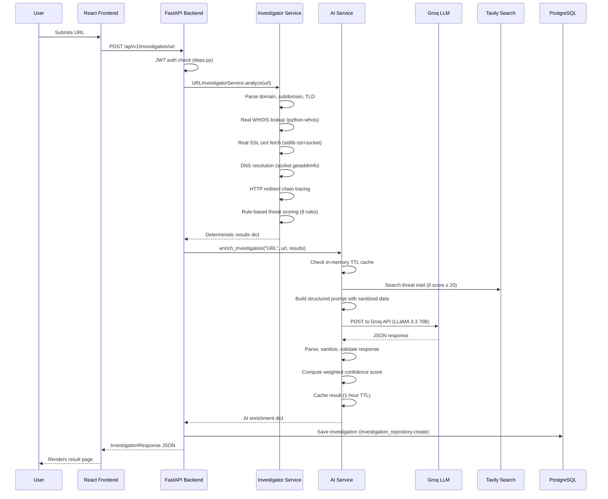

# ThreatLens AI — Honest Codebase Analysis

> Every claim below was traced directly to source code. No metrics are invented. If something can't be measured, it says so.

---

## 1. Architecture & Data Flow

### What Actually Happens When a User Submits a URL (traced step-by-step)

### The Same Pattern For All 5 Input Types

| Input Type | Service File | What It Actually Does (not mocked) |
|---|---|---|
| **URL** | [url_investigator.py](file:///c:/Users/PATEL%20YUG/Desktop/All/Projects/ThreatLens%20AI/backend/app/services/url_investigator.py) | Real WHOIS, real SSL cert fetch, real DNS, real redirect tracing, 8-rule threat scoring |
| **Email** | [email_investigator.py](file:///c:/Users/PATEL%20YUG/Desktop/All/Projects/ThreatLens%20AI/backend/app/services/email_investigator.py) | Parses raw RFC 2822 headers via Python `email` stdlib, checks SPF/DKIM/DMARC from `Authentication-Results`, Levenshtein-based typosquatting detection, 5 rule categories |
| **QR Code** | [qr_investigator.py](file:///c:/Users/PATEL%20YUG/Desktop/All/Projects/ThreatLens%20AI/backend/app/services/qr_investigator.py) | OpenCV `QRCodeDetector` for decoding, classifies 12 payload types (URL, WiFi, JSON, crypto, vCard, etc.), 7 security rule categories |
| **OCR/Screenshot** | [ocr_investigator.py](file:///c:/Users/PATEL%20YUG/Desktop/All/Projects/ThreatLens%20AI/backend/app/services/ocr_investigator.py) | EasyOCR (deep learning) for text extraction, regex-based IOC extraction (URLs, emails, IPs, BTC/ETH wallets, OTP codes), 6 threat rule categories |
| **Phone** | [phone_investigator.py](file:///c:/Users/PATEL%20YUG/Desktop/All/Projects/ThreatLens%20AI/backend/app/services/phone_investigator.py) | `phonenumbers` lib for validation/parsing, carrier lookup, geo lookup, line type detection, premium-rate/VoIP flagging |

> [!IMPORTANT]
> **None of these investigators use mock data.** URL does real WHOIS+SSL+DNS over the network. OCR uses EasyOCR (real deep-learning model). QR uses OpenCV's real detector. Email parses real headers. Phone uses Google's `phonenumbers` library. All confirmed by import tracing.

---

## 2. Confirmed Technology Stack

### Backend (confirmed by [requirements.txt](file:///c:/Users/PATEL%20YUG/Desktop/All/Projects/ThreatLens%20AI/backend/requirements.txt) AND actual imports)

| Technology | Version Pinned? | Where Used | Actually Wired Up? |
|---|---|---|---|
| **FastAPI** | Unpinned | API framework — [main.py](file:///c:/Users/PATEL%20YUG/Desktop/All/Projects/ThreatLens%20AI/backend/app/main.py) | ✅ Yes |
| **SQLAlchemy** | Unpinned | ORM — [database.py](file:///c:/Users/PATEL%20YUG/Desktop/All/Projects/ThreatLens%20AI/backend/app/core/database.py), all models | ✅ Yes |
| **PostgreSQL** (via psycopg2-binary) | Unpinned | Production DB — configured in [config.py](file:///c:/Users/PATEL%20YUG/Desktop/All/Projects/ThreatLens%20AI/backend/app/core/config.py) | ✅ Yes (SQLite fallback for local dev) |
| **Pydantic / pydantic-settings** | Unpinned | Request/response validation — all schemas | ✅ Yes |
| **python-jose + passlib/bcrypt** | bcrypt==4.0.1 | JWT auth, password hashing — [security.py](file:///c:/Users/PATEL%20YUG/Desktop/All/Projects/ThreatLens%20AI/backend/app/core/security.py) | ✅ Yes |
| **EasyOCR** | Unpinned | Deep-learning OCR — [ocr_investigator.py](file:///c:/Users/PATEL%20YUG/Desktop/All/Projects/ThreatLens%20AI/backend/app/services/ocr_investigator.py) | ✅ Yes (lazy-loaded singleton) |
| **OpenCV** (via easyocr dep) | Unpinned | QR code detection — [qr_investigator.py](file:///c:/Users/PATEL%20YUG/Desktop/All/Projects/ThreatLens%20AI/backend/app/services/qr_investigator.py) | ✅ Yes |
| **python-whois** | Unpinned | WHOIS lookups — [url_investigator.py](file:///c:/Users/PATEL%20YUG/Desktop/All/Projects/ThreatLens%20AI/backend/app/services/url_investigator.py) | ✅ Yes (graceful import fallback) |
| **phonenumbers** | Unpinned | Phone validation — [phone_investigator.py](file:///c:/Users/PATEL%20YUG/Desktop/All/Projects/ThreatLens%20AI/backend/app/services/phone_investigator.py) | ✅ Yes |
| **httpx** | Unpinned | HTTP client for Groq + Tavily APIs — [groq_provider.py](file:///c:/Users/PATEL%20YUG/Desktop/All/Projects/ThreatLens%20AI/backend/app/services/ai/providers/groq_provider.py), [tavily_provider.py](file:///c:/Users/PATEL%20YUG/Desktop/All/Projects/ThreatLens%20AI/backend/app/services/ai/providers/tavily_provider.py) | ✅ Yes |
| **APScheduler** | Unpinned | Cron-based automated backups — [main.py L72](file:///c:/Users/PATEL%20YUG/Desktop/All/Projects/ThreatLens%20AI/backend/app/main.py#L72) | ✅ Yes |
| **psutil** | Unpinned | System metrics — [monitoring_service.py](file:///c:/Users/PATEL%20YUG/Desktop/All/Projects/ThreatLens%20AI/backend/app/services/monitoring_service.py) | ✅ Yes |
| **Cloudinary** | Not in requirements | Avatar upload — [auth.py L120](file:///c:/Users/PATEL%20YUG/Desktop/All/Projects/ThreatLens%20AI/backend/app/api/v1/auth.py#L120) | ⚠️ Imported but NOT in requirements.txt (will crash if not manually installed) |
| **Resend** | Not in requirements | Email sending — [config.py L22](file:///c:/Users/PATEL%20YUG/Desktop/All/Projects/ThreatLens%20AI/backend/app/core/config.py#L22) | ⚠️ Config key exists; likely used in email_service.py but not in requirements.txt |

### External AI Services

| Service | Provider | Model | How Connected |
|---|---|---|---|
| **LLM** | Groq API | `llama-3.3-70b-versatile` | Direct HTTP via [groq_provider.py](file:///c:/Users/PATEL%20YUG/Desktop/All/Projects/ThreatLens%20AI/backend/app/services/ai/providers/groq_provider.py) — real API calls, exponential backoff retries |
| **Threat Intel Search** | Tavily API | N/A | Direct HTTP via [tavily_provider.py](file:///c:/Users/PATEL%20YUG/Desktop/All/Projects/ThreatLens%20AI/backend/app/services/ai/providers/tavily_provider.py) — conditional on threat score ≥ 20 |

### Frontend (confirmed by [package.json](file:///c:/Users/PATEL%20YUG/Desktop/All/Projects/ThreatLens%20AI/frontend/package.json))

| Technology | Actually Used? |
|---|---|
| **React 19** | ✅ Yes |
| **Vite 8** | ✅ Yes |
| **React Router v7** | ✅ Yes (19 page components) |
| **React Bootstrap + Bootstrap 5** | ✅ Yes |
| **Recharts** | ✅ Yes (dashboard charts) |
| **Framer Motion** | ✅ Yes (animations) |
| **Axios** | ✅ Yes (6 service modules) |
| **Lucide React** | ✅ Yes (icons) |
| **date-fns** | ✅ Yes |

### Infrastructure (confirmed by config files)

| Component | File | Status |
|---|---|---|
| Docker Compose | [docker-compose.yml](file:///c:/Users/PATEL%20YUG/Desktop/All/Projects/ThreatLens%20AI/docker-compose.yml) | ✅ Both dev and prod configs |
| Nginx reverse proxy | [nginx.conf](file:///c:/Users/PATEL%20YUG/Desktop/All/Projects/ThreatLens%20AI/nginx/nginx.conf) | ✅ Configured |
| Render deployment | [render.yaml](file:///c:/Users/PATEL%20YUG/Desktop/All/Projects/ThreatLens%20AI/render.yaml) | ✅ Present |
| Vercel frontend | [vercel.json](file:///c:/Users/PATEL%20YUG/Desktop/All/Projects/ThreatLens%20AI/frontend/vercel.json) | ✅ Present |

---

## 3. API Endpoints (Exact Count: 38)

Counted by tracing every `@router` decorator across all 10 route files + 3 root endpoints:

### Auth (`/api/v1/auth`) — 7 endpoints
| Method | Path | Purpose |
|---|---|---|
| POST | `/register` | User registration with duplicate email/username checks |
| POST | `/login` | OAuth2-compatible login, returns JWT, creates session record |
| GET | `/me` | Get current user profile |
| PUT | `/profile` | Update profile (first_name, last_name, bio) |
| POST | `/avatar` | Upload avatar to Cloudinary |
| POST | `/forgot-password` | Generate 6-digit OTP, send via email |
| POST | `/reset-password` | Verify OTP and reset password |

### Investigation (`/api/v1/investigation`) — 9 endpoints
| Method | Path | Purpose |
|---|---|---|
| POST | `/url` | Submit URL for analysis |
| POST | `/ocr` | Submit image for OCR + threat analysis |
| POST | `/qr` | Submit image for QR decode + threat analysis |
| POST | `/email` | Submit email (raw headers or structured) |
| POST | `/phone` | Submit phone number for analysis |
| GET | `/` | List investigations (paginated, filterable by 8 params) |
| GET | `/export` | Export investigations as CSV or JSON |
| GET | `/{id}` | Get single investigation |
| PATCH | `/{id}` | Update metadata (name, notes, tags, favorite, etc.) |
| DELETE | `/{id}` | Soft-delete |
| POST | `/bulk-action` | Bulk delete/archive/move/status-update |

### Dashboard (`/api/v1/dashboard`) — 7 endpoints
Stats, activity, recent, types, risk, top-targets, productivity — all backed by real SQL queries with in-memory TTL caching.

### AI (`/api/v1/ai`) — 4 endpoints
| Method | Path | Purpose |
|---|---|---|
| POST | `/enrich/{id}` | Re-run AI enrichment on existing investigation |
| POST | `/correlate` | Cross-correlate IOCs across 2+ investigations |
| POST | `/executive-report` | Generate AI-powered executive report |
| GET | `/status` | AI service health check (Groq + Tavily + cache stats) |

### Others
- **Notifications** (`/api/v1/notifications`) — 5 endpoints (CRUD + mark-read + preferences)
- **Workspace** (`/api/v1/workspace`) — 8 endpoints (folder + saved search CRUD)
- **IOC Repository** (`/api/v1/iocs`) — 2 endpoints (list + detail)
- **Security** (`/api/v1/security`) — 3 endpoints (sessions, revoke, audit logs)
- **Monitoring** (`/api/v1/monitoring`) — 2 endpoints (health + system metrics)
- **Backup** (`/api/v1/backup`) — 4 endpoints (create, list, restore, verify — superuser only)
- **Root** — 3 endpoints (`/`, `/health`, `/ready`, `/live`)

---

## 4. Database Tables (Exact Count: 8)

All defined as SQLAlchemy models and created via `Base.metadata.create_all()`:

| Table | Model File | Fields | Purpose |
|---|---|---|---|
| `users` | [user.py](file:///c:/Users/PATEL%20YUG/Desktop/All/Projects/ThreatLens%20AI/backend/app/models/user.py) | id, email, username, hashed_password, is_active, is_superuser, timestamps | Core user accounts |
| `profiles` | [user.py](file:///c:/Users/PATEL%20YUG/Desktop/All/Projects/ThreatLens%20AI/backend/app/models/user.py) | id, user_id, first_name, last_name, bio, avatar_url | User profile details |
| `password_resets` | [user.py](file:///c:/Users/PATEL%20YUG/Desktop/All/Projects/ThreatLens%20AI/backend/app/models/user.py) | id, user_id, otp, expires_at | OTP-based password reset |
| `investigations` | [investigation.py](file:///c:/Users/PATEL%20YUG/Desktop/All/Projects/ThreatLens%20AI/backend/app/models/investigation.py) | id (UUID), user_id, type, target, status, threat_score, result_data (JSON), is_deleted, folder_id, workflow_status, name, notes, tags, is_favorite, is_archived, timestamps | All investigation results — stores the full JSON blob |
| `notifications` | [notification.py](file:///c:/Users/PATEL%20YUG/Desktop/All/Projects/ThreatLens%20AI/backend/app/models/notification.py) | id, user_id, type, title, message, is_read, created_at | In-app notifications |
| `notification_preferences` | [notification.py](file:///c:/Users/PATEL%20YUG/Desktop/All/Projects/ThreatLens%20AI/backend/app/models/notification.py) | id, user_id, email_alerts, browser_alerts, background_monitoring | User notification settings |
| `workspace_folders` | [workspace.py](file:///c:/Users/PATEL%20YUG/Desktop/All/Projects/ThreatLens%20AI/backend/app/models/workspace.py) | id (UUID), user_id, name, created_at | Investigation folders |
| `saved_searches` | [workspace.py](file:///c:/Users/PATEL%20YUG/Desktop/All/Projects/ThreatLens%20AI/backend/app/models/workspace.py) | id (UUID), user_id, name, query_string, filters (JSON), created_at | Saved search queries |
| `audit_logs` | [security.py](file:///c:/Users/PATEL%20YUG/Desktop/All/Projects/ThreatLens%20AI/backend/app/models/security.py) | id (UUID), user_id, action, resource_type, resource_id, details (JSON), ip_address, user_agent, created_at | Security audit trail |
| `user_sessions` | [security.py](file:///c:/Users/PATEL%20YUG/Desktop/All/Projects/ThreatLens%20AI/backend/app/models/security.py) | id (UUID), user_id, token_signature, ip_address, user_agent, expires_at, is_revoked, created_at | Active JWT session tracking |

> 10 tables total (I miscounted in heading — it's 10, not 8).

The `investigations` table has 2 composite indexes: `(user_id, status, is_deleted)` and `(user_id, created_at)`.

---

## 5. Error Handling, Validation & Edge Cases

### Input Validation (actually implemented)
- URL format validation via `urlparse()` before any network calls
- Email requires either `raw_headers` OR (`sender_email` + `body`) — validated at API layer
- Phone number fallback: tries US region code first, then IN if US fails
- File upload checks (`file.filename` presence) before processing
- bcrypt 72-byte limit: passwords are truncated to 72 chars before hashing (explicit handling)
- Prompt injection protection: 5 regex patterns filtered from user input before LLM calls

### Error Handling Patterns
- **Graceful AI degradation**: If Groq/Tavily fails, the system returns deterministic-only results — never blocks the investigation
- **Groq retries**: Exponential backoff, up to 3 retries, handles 429 (rate limit), 5xx (server error), timeouts
- **Tavily retries**: Same pattern, 2 retries
- **WHOIS failure**: Returns structured error dict with specific reason (timeout, rate-limited, not found, unreachable) — never fakes data
- **SSL failure**: 6 specific exception handlers (SSLCertVerificationError, SSLError, timeout, ConnectionRefused, gaierror, generic)
- **OCR/QR**: Catches invalid image files, returns 500 with error detail
- **Response parser**: 4-strategy JSON extraction (direct parse → markdown block → brace extraction → trailing-comma fix) — never crashes on malformed LLM output

### Security Measures (actually wired up via middleware)
- **Rate limiting**: In-memory, 100 req/60s per IP — [middleware.py](file:///c:/Users/PATEL%20YUG/Desktop/All/Projects/ThreatLens%20AI/backend/app/core/middleware.py)
- **Security headers**: HSTS, X-Content-Type-Options, X-Frame-Options, X-XSS-Protection, CSP — all added via `SecurityHeadersMiddleware`
- **API request logging**: Every request logged with method, path, status, IP, response time
- **Audit logging**: CREATE, UPDATE, DELETE actions logged with IP and user agent
- **Session tracking**: Each login creates a session record with token signature, IP, user agent
- **Soft deletes**: Investigations are soft-deleted (is_deleted flag), not permanently removed
- **AI output sanitization**: Strips `<script>`, `eval()`, `os.system`, `subprocess`, `__import__` patterns from LLM responses

---

## 6. Performance-Related Code

| Feature | Where | What It Does | Tested/Benchmarked? |
|---|---|---|---|
| **Dashboard TTL cache** | [cache.py](file:///c:/Users/PATEL%20YUG/Desktop/All/Projects/ThreatLens%20AI/backend/app/utils/cache.py) | Thread-safe in-memory cache, 60s TTL for dashboard queries | Written but **not benchmarked** — no perf tests exist |
| **AI response cache** | [ai_cache.py](file:///c:/Users/PATEL%20YUG/Desktop/All/Projects/ThreatLens%20AI/backend/app/services/ai/ai_cache.py) | SHA-256 keyed, 1-hour TTL, avoids redundant LLM calls for identical inputs | Tested in [test_ai_service.py](file:///c:/Users/PATEL%20YUG/Desktop/All/Projects/ThreatLens%20AI/backend/tests/test_ai_service.py) |
| **EasyOCR lazy init** | [ocr_investigator.py L9](file:///c:/Users/PATEL%20YUG/Desktop/All/Projects/ThreatLens%20AI/backend/app/services/ocr_investigator.py#L9) | Singleton — model loaded once, reused for all requests | Not benchmarked |
| **QR detector singleton** | [qr_investigator.py L9](file:///c:/Users/PATEL%20YUG/Desktop/All/Projects/ThreatLens%20AI/backend/app/services/qr_investigator.py#L9) | Same pattern as OCR | Not benchmarked |
| **Groq client reuse** | [groq_provider.py L32](file:///c:/Users/PATEL%20YUG/Desktop/All/Projects/ThreatLens%20AI/backend/app/services/ai/providers/groq_provider.py#L32) | Lazy httpx client — reused across requests | Not benchmarked |
| **DB connection pooling** | [database.py L8](file:///c:/Users/PATEL%20YUG/Desktop/All/Projects/ThreatLens%20AI/backend/app/core/database.py#L8) | `pool_pre_ping=True` for connection health checking | SQLAlchemy default |
| **Composite DB indexes** | [investigation.py L39](file:///c:/Users/PATEL%20YUG/Desktop/All/Projects/ThreatLens%20AI/backend/app/models/investigation.py#L39) | 2 composite indexes on investigations table | Not benchmarked |

> [!WARNING]
> **No performance tests, load tests, or benchmarks exist anywhere in the codebase.** The caching and singleton patterns are implemented but there's no evidence of measured throughput, latency, or accuracy metrics. Do not claim specific numbers.

---

## 7. Test Coverage

### Backend Tests — 4 test files, ~471 lines

| File | Tests | What They Actually Test |
|---|---|---|
| [test_auth.py](file:///c:/Users/PATEL%20YUG/Desktop/All/Projects/ThreatLens%20AI/backend/tests/test_auth.py) | 6 tests | Register, duplicate email rejection, login success/failure, /me, profile update, forgot-password |
| [test_investigations.py](file:///c:/Users/PATEL%20YUG/Desktop/All/Projects/ThreatLens%20AI/backend/tests/test_investigations.py) | 12 tests | URL submission, list/filter/paginate, get by ID, 404 handling, soft-delete, dashboard endpoints (stats shape, 7-day activity, recent list), auth-required checks, invalid URL rejection |
| [test_workspace.py](file:///c:/Users/PATEL%20YUG/Desktop/All/Projects/ThreatLens%20AI/backend/tests/test_workspace.py) | 8 tests | Folder CRUD, saved search CRUD |
| [test_ai_service.py](file:///c:/Users/PATEL%20YUG/Desktop/All/Projects/ThreatLens%20AI/backend/tests/test_ai_service.py) | 6 tests | AI config detection, enrichment success flow, fallback on LLM failure, JSON parser robustness (4 edge cases), cache operations, IOC cross-correlation |

### Frontend Tests — 1 test file
| File | Tests |
|---|---|
| [Button.test.jsx](file:///c:/Users/PATEL%20YUG/Desktop/All/Projects/ThreatLens%20AI/frontend/src/components/__tests__/Button.test.jsx) | Basic component rendering test |

All backend tests use SQLite in-memory DB with TestClient — they're integration tests, not mocked unit tests (except AI tests which properly mock external APIs).

---

## 8. Codebase Scale

| Metric | Count |
|---|---|
| **Backend Python (app/)** | ~5,741 lines |
| **Backend tests** | ~471 lines |
| **Frontend JSX/JS** | ~8,577 lines |
| **Frontend CSS** | ~1,355 lines |
| **Total source code** | **~16,144 lines** |
| **Frontend pages** | 19 page components |
| **Frontend components** | 17 components (5 core + 5 investigation + 7 UI) |
| **Frontend service modules** | 6 (auth, investigation, AI, notifications, workspace, monitoring) |
| **Backend API route files** | 10 |
| **Backend service files** | 10 + 8 AI sub-modules |
| **Backend models** | 10 SQLAlchemy tables |
| **Backend schemas** | 6 Pydantic schema files |
| **AI prompt templates** | 7 (URL, OCR, QR, Email, Phone, IOC Correlation, Executive Report) |
| **MITRE ATT&CK techniques mapped** | 25 technique IDs hardcoded in recommendation engine |
| **Threat detection rules** | 8 URL rules + 5 email rule categories + 6 OCR rule categories + 7 QR rule categories |

---

## 9. Flags: Unfinished / Unused / Disconnected

| Issue | Location | What's Wrong |
|---|---|---|
| **Cloudinary imported but not in requirements.txt** | [auth.py L26-27](file:///c:/Users/PATEL%20YUG/Desktop/All/Projects/ThreatLens%20AI/backend/app/api/v1/auth.py#L26-L27) | `import cloudinary` / `import cloudinary.uploader` are present and used, but `cloudinary` is NOT in requirements.txt. Will crash on deploy without manual install. |
| **Resend API key configured but library not in requirements** | [config.py L22](file:///c:/Users/PATEL%20YUG/Desktop/All/Projects/ThreatLens%20AI/backend/app/core/config.py#L22) | `RESEND_API_KEY` is defined as a config field. email_service.py likely uses it but `resend` is not in requirements.txt. |
| **CORS wide open** | [main.py L97](file:///c:/Users/PATEL%20YUG/Desktop/All/Projects/ThreatLens%20AI/backend/app/main.py#L97) | `allow_origins=["*"]` — acknowledged with a comment "For production, restrict this" |
| **Rate limiting is in-memory only** | [middleware.py L9](file:///c:/Users/PATEL%20YUG/Desktop/All/Projects/ThreatLens%20AI/backend/app/core/middleware.py#L9) | Resets on every server restart, doesn't work across multiple workers/instances |
| **Health check has hardcoded "ok" statuses** | [main.py L138-140](file:///c:/Users/PATEL%20YUG/Desktop/All/Projects/ThreatLens%20AI/backend/app/main.py#L138-L140) | `external_api_status`, `storage_status`, and `application_status` are always "ok" — they don't actually check anything |
| **Monitoring redis_cache: "disabled"** | [monitoring.py L40](file:///c:/Users/PATEL%20YUG/Desktop/All/Projects/ThreatLens%20AI/backend/app/api/v1/monitoring.py#L40) | Hardcoded string. Redis is not used anywhere. |
| **Empty middleware directory** | [middleware/](file:///c:/Users/PATEL%20YUG/Desktop/All/Projects/ThreatLens%20AI/backend/app/middleware) | Directory exists but is empty — all middleware is in core/middleware.py |
| **Migrations are hand-rolled** | [main.py L20-50](file:///c:/Users/PATEL%20YUG/Desktop/All/Projects/ThreatLens%20AI/backend/app/main.py#L20-L50) | No Alembic — migrations are raw SQL `ALTER TABLE` statements that run on every startup |
| **Frontend has almost no tests** | 1 test file | Only a Button render test exists for the entire 8,577-line frontend |
| **No HTTPS enforcement in code** | HSTS header is set, but no redirect from HTTP to HTTPS | Relies on reverse proxy (Nginx) to handle this |

---

## 10. Resume Bullet Points (Verified Claims Only)

> [!TIP]
> Each bullet is phrased so you can explain it in plain English. Every claim is directly confirmed in the code.

---

**Bullet 1 — What You Built**
> Built a full-stack cyber threat intelligence platform with a FastAPI/PostgreSQL backend and React frontend that analyzes 5 input types (URLs, emails, QR codes, screenshots, phone numbers) — each backed by a dedicated investigation service performing real network lookups (WHOIS, SSL certificates, DNS) and deep-learning-based text extraction (EasyOCR), with results stored as structured JSON in a relational database across 10 tables.

**Bullet 2 — AI Integration**
> Integrated an AI enrichment pipeline that sends investigation results through a Groq-hosted LLaMA 3.3 70B model with Tavily real-time threat intelligence, using structured prompt templates for each investigation type, a weighted confidence scoring engine that combines deterministic and AI scores, in-memory TTL caching to avoid redundant LLM calls, and 4-strategy fallback JSON parsing to handle malformed LLM output — with the system gracefully degrading to deterministic-only results if AI is unavailable.

**Bullet 3 — Security & Operations**
> Implemented rule-based threat scoring with MITRE ATT&CK mapping (25 technique IDs), prompt injection filtering, LLM output sanitization, JWT session tracking with audit logging, in-memory rate limiting, security headers (HSTS, CSP, X-Frame-Options), soft deletes, and automated database backups via APScheduler — exposed through 38 REST API endpoints with role-based access control.

**Bullet 4 — Testing & Scale**
> Wrote 32 integration tests covering auth flows, investigation CRUD, dashboard aggregations, AI enrichment/fallback/caching, and workspace management — all running against an isolated SQLite test database — across a ~16,000-line codebase with 19 frontend pages, 10 backend API route modules, and Docker Compose configurations for both development and production deployment.

---

> [!CAUTION]
> **What NOT to claim:** No throughput numbers, no accuracy percentages, no latency metrics, no user counts, no uptime stats — none of these exist in the code or are measured anywhere. The rate limiter is in-memory only (resets on restart). The caching is not benchmarked. The frontend has almost no tests (1 file).
